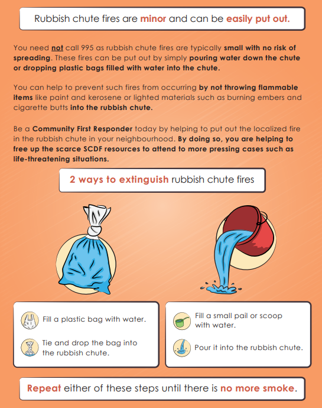

# Detailed Solutions
In this section, we will be taking a more in depth look into *ohChute!*. As such, this section will elaborate on the 3 main high-level components of the project architecture: 

1. [Onsite Hardware](#onsite-hardware)
2. [Backend Software](#backend-software)
3. [Frontend Software](#frontend-software)

All these components work hand in hand to provide a solution that is autonomous, efficient and comprehensive.

## Onsite Hardware
*ohChute!* involves the installation of simple hardware materials within the rubbish chute collection points of every HDB block around the island. Our solution aims to build on a simple hardware unit proposed in the study "FireNet: A Specialized Lightweight Fire & Smoke Detection Model for Real-Time IoT Applications". The figure below shows overview of the complete IoT enabled fire detection unit, proposed in this study:

Similarly, our solution involves the use of the Arduino Uno and Raspberry Pi. In addition to these development boards, we will be connecting peripherals such as a Carbon Monoxide (CO) Gas Sensor and a Camera module. The following sections will give a deeper explanation on the reasoning behind the choices of these components.

#### Arduino Uno
The Arduino Uno is a simple, cheap and lightweight development board that can be easily programmed to meet the needs of this project. In addition, we feel that the Arduino Uno is compatible with a large plethora of peripherals, allowing for modularization of the components which in turn improves maintenance and upgradability.

#### Raspberry Pi
The Raspberry Pi is a cheaped computer, capable of even running its own OS, Linux. We believe that the Pi works flawlessly together with the Arduino, by providing it with the needed processing power and onboard memory to run the software for the Arduino peripherals. The Pi will also be able to seamlessly send real-time data

#### Carbon Monoxide (CO) Gas Sensor
An MQ-7 Gas Sensor will be powered and controlled by the Arduino Uno. The MQ-7 is a simple-to-use sensor suitable for sensing CO concentrations in an environment. It is able to detect CO-gas concentrations anywhere from 10 to 500ppm. Additionally, the sensor has a high sensitivity and fast response time. It returns an analog voltage that is proportional to the ppm levels in the air. We believe the MQ-7 is effective in detecting fires as CO concentrations are able to accurately depict the occurrence of a fire. This is supported by an experimental investigation that used CO sensors to detect smouldering fires in dwellings. Link found here: https://nfpa.org/-/media/Files/News-and-Research/Resources/Research-Foundation/Symposia/2016-SUPDET/2016-Papers/SUPDET2016SessengReitan.ashx

#### Camera Module
Our unit will utilize an OV7670 Camera Module. The OV7670 is a small volume image sensor that is powered by a single chip of VGA camera and image processor. The VGA camera is capable of reaching a maximum of 30 frames per second. Additionally, the camera is able to take image snapshots with a resolution of 640x480, which is effective enough in highlighting the details within the captured image

*ohChute!* utilises simple, cheap and low power hardware materials to create an IoT sensor capable of detecting fires in rubbish chutes. The hardware modules and development boards are very easily accessible in the market and can be very beneficial when it comes to prototype development. We feel that the proposed hardware solutions will provide a good base for future developments.

## Backend Software
The hardware unit is fully capable of collecting valuable data. However, on its own, it will be expensive and very CPU intensive to run heavy software on the unit itself. As such, it is important to modularize the solution by “outsourcing” the software portion of the project into a cloud. Our project utilises the IBM Cloud service.

IBM Cloud provides a wide range of cloud computing services and infrastructure that can be easily implemented into our project. Within IBM Cloud, *ohChute!” consists of 3 main components - (1) Node-RED, (2) Cloud Foundry and a (3) Fire Detection Algorithm.

#### Node-RED
Node-RED is a simple flow-based development tool that can be used to wire together our hardware and software components of our project. Its web browser-based flow editor provides a very seamless development experience. Our Node-RED project flow allows us to route data through the Cloud Foundry and the Fire Detection Algorithm, all the way through to our end users’ UI.

#### Cloud Foundry
The Cloud Foundry is an essential open-source platform that we can use to store data that is retrieved from our IoT unit. Within the Cloud Foundry, there exist 2 main documents - CO Data and Camera Data. CO Data is mainly used to store the voltage values retrieved from the MQ-7 module. On the other hand, the Camera Data can be seen as a gallery which holds all the images taken with the OV7670 module. The IoT unit will be sending data periodically to the Cloud Foundry at 20 second intervals. In other words, the MQ-7 and OV7670 will be recording CO levels and taking pictures respectively, every 20 seconds, the data will then be sent to the Arduino Uno forest then the Raspberry Pi, which will be able to upload it to the Cloud Foundry. The data uploaded will be tied together with the chute number and the corresponding address where the unit is installed.

#### Fire Detection Algorithm
The Fire Detection Algorithm is the main brains behind *ohChute!*. The algorithm takes in data from the Cloud Foundry and processes them, to determine if there is a fire. The algorithm has 2 main heuristics to allow this. 

It makes use of a simple model trained with IBM’s Watson Visual Recognition service. The model is able to take in images and perform image classification to determine if there is a fire or not. The model was trained through Machine Learning, by inputting a large dataset of images with fires and without fires (can be retrieved from https://www.kaggle.com/phylake1337/fire-dataset). After training, the model is easily able to distinguish if the image retrieved from the Cloud Foundry has a fire, and also return a Confidence Index (CI) with it.

In addition to the Visual Recognition model, we also make use of a very simple Javascript code as shown below.

The algorithm simply takes in the 10 latest CO values from the cloud and takes the average voltage value. The algorithm sets a threshold of 4.5V (55pm) to determine if the CO levels are excessively high.
With this 2 heuristics in place, the algorithm will be able to determine if there is a fire. If the Visual Recognition model returns a CI of at least 0.91, and the JS code returns a True, the overall algorithm will return True, to indicate that there is a fire. This boolean value will be stored in a new document within the Cloud Foundry, Result Doc. 

## Frontend Software
The frontend Software aims to convert data from the Result Doc into a clean and easy to use User Interface for CFRs and the Town Council. Undoubtedly, the SCDf ops room will also have access to the information and if the rubbish chute fire requires attention. However, this frontend implementation aims to empower the CFRs and the Town Council to handle minor fires so that SCDF’s valuable resources will not be wasted. The Result Doc will contain key information such as the boolean value indicating a fire, its corresponding address, chute number, CO ppm value and picture. The Result Doc also serves as a way to be able to update all parties with the current status of any ongoing chute fires and if it has been attended to or not. All this information will then be displayed seamlessly onto an UI used by the respective parties.

#### MyResponders App Upgrade
*ohChute!* aims to upgrade the existing MyResponders application to include 2 new pages - an improved Acceptance Page for rubbish chute fires and a new Instructions Page that will briefly teach users on how to easily put out rubbish chute fires.

When there is a rubbish chute fire, any nearby CFRs will be sent a notification and given the ability to accept the incident through the Acceptance Page, The Acceptance Page will clearly indicate the incident to be a ‘Rubbish Chute Fire’, and the relevant address will be provided. Furthermore, an image of the fire from the Result Doc will also be shown to the CFRs. We believe that an image of the fire will be a great addition as it will provide CFRs with the confidence to accept the incident and manage the fire on their own. This will then reduce the need of sending SCDF responders down to the incident for a minor incident. Once accepted, there will be an Instructions Page which provides CFRs with easy ways to combat rubbish chute fires, shown in the image below. (image retrived from an SCDF flyer https://www.scdf.gov.sg/docs/default-source/scdf-library/rubbish-chute-fire---flyer.pdf)

#### UI for Town Council
*ohChute!* will also be able to provide the Town Council with valuable information regarding rubbish chutes in the respective neighbourhoods, and display it a very feasible manner. The UI will mainly be in a table format. Each entry in the table pertains to a single chute number and address/block of the chute. 

In addition to this information, in each entry, the operator will also be able to click on a link which will show the latest image taken and ppm value of the corresponding chute. Based on the boolean value in the Result Doc, YES will be indicated to show that the chute requires attention, NO if otherwise. Additionally, there will be a status which shows if anyone has attended to the situation. We believe that this is a very important feature. Since the information is from the Cloud Foundry which syncs information between the SCDF ops room and the Town council, both parties will be able to easily see if a rubbish chute fire has been attended to or not. For example, the status can show "Dispatched" if someone has indicated that they will proceed to the scene, and show "Attended to" if the fire has been dealt with. The status will also include the party that has updated the status (either a CFR or Town Council staff) as well as the timing at which the status was updated.
EG. “Dispatched to as of HH:MM from PARTY” or  “Require Attention” or “Attended as of HH:MM”, depending on the current situation.

Additionally, for each chute number, the Town Council operator will also have access to the number of past fires that have happened at the chute and the dates of incident. This will allow the Town Council operators to easily have easy access to the trends of chute fires.
