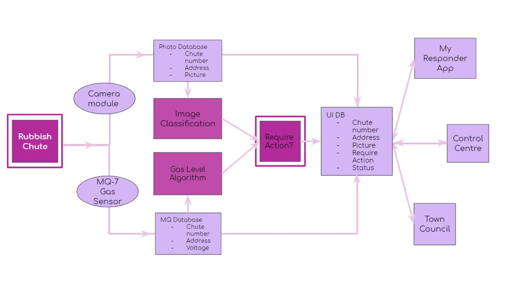

# Circodebreakers: ohChute! SCDFxIBM

## Table of Contents
### 1. [About Us](#about-us)
### 2. [Problem Statement](#problem-statement)
### 3. [Pitch Video](#pitch-video)
### 4. [Project Architecture](#project-architecture)
### 5. [Detailed Solutions](#detailed-solutions)
### 6. [Tools Used](#tools-used)

## About Us 
We are the **circodeBreakers**! We are a team of NUS undergradutaes from various disciplines. 
Let us introduce ourselves!

**Amir Azhar** *Year 3 Computer Engineering Major*
 
**Md Faizudeen** *Year 3 Chemical Engineering Major*
 
**Nur Aisyah Lyana** *Year 3 Double Major in Global Studies and Malay Studies*

So as you can probably tell from our team name, we were a bunch of bored kids stuck at home during the Circuit-Breaker and thought that it was a good idea to try something new, that is the SCDF-X-IBM Hackathon. 

A very good idea indeed.

Within 48 hours, we've come up with a project solution called *ohChute!* that tackles the large rubbish chute fires that consistently make up the bulk of the reported residential fires in Singapore for many years. Please read on!

## Problem Statement 
This is the problem statement that our group aims to tackle:

#### Integrating with a Smart Environment

Infrastructure is getting “smart”, with sensors and Internet of things (IoT) increasingly embedded in the built environment (e.g. Punggol Digital District). How might we leverage a network of smart infrastructure in the built environment to make better and more timely sense of emergency incidents (e.g. detection of fires developing, building collapses, falls, road traffic accidents etc.) and to trigger early intervention measures, without the need to activate precious emergency resources?

#### The Problem at a Glance

According to the available fire statistics from the National Fire and Civil Emergency Preparedness Council (NFEC), rubbish chute fires have consistently formed the bulk of all fires (more than 50%) received by the SCDF from 2004 to 2015. Even in a recent news article reported by The Straits Times (Dec 12, 2018), rubbish chute fires still constitute 1 in 2 of residential fires.

Rubbish chute fires are considered minor cases by the SCDF since the fires have a small risk of spreading and can be easily contained by members of the public.

Yet, 

1. SCDF still receives many calls from the public on the 995 emergency hotline, which is already often busy due to medical emergencies, and

2. SCDF continues to activate its precious emergency resources by physically dispatching a fire vehicle (typically the Red Rhino) and a team of 4 firefighters to assess the situation on-the-ground as well as to record details of such events to identify hotspots of rubbish chute fire cases. 

As seen from the above, rubbish chute fires cause a strain on precious emergency resources such as the available call operators and firefighting vehicles which could be better used for more serious emergencies. Furthermore, with an increasingly aging population, the number of available firefighters in the future will be significantly reduced. Thus, it is even more crucial to delegate limited manpower resources to respond to critical emergencies.

Before we address the above mentioned problems, we first analyse the current existing solutions and leverage on the existing smart environment infrastructures before proposing solutions.

##### Analysing existing solutions
We have also identified SCDF’s existing solutions (using the datasets on NFEC’s website) and their areas for improvement:

1. In 2006, automatic sprinklers were installed within some rubbish chutes in some blocks in Jurong West. Problems with this existing solution: 
- High installation costs 
- The moist environment within the chutes corroded the heat detectors, rendering them ineffective
- Promotes bacterial growth 
- The discarded water makes the rubbish heavy and inconvenient for the garbage collectors

2. In 2011, buttons to activate the chute flushing system were installed in the common areas of some blocks in Tanjong Pagar GRC, so residents could press them to release water down the chute if a fire broke out. Problems with this existing solution: 
- High false alarms
- High water wastage due to misuse of pressed buttons despite no rubbish chute fires
- Promotes Bacterial growth

The existing smart infrastructures also include heat sensors that are installed at the bin centres. Leveraging on these existing technologies, we propose to detect developing fires in the chutes so as to trigger early intervention measures whereby the Community First Responders can be notified via the MyResponder mobile application and first respond to the fires instead of relying on the SCDF to dispatch a team of firefighters. This is in line with SCDF’s current Transformation Vision 2025 of Building a Nation of Lifesavers by 2025.  Furthermore, handling of minor rubbish chute fires would build a stronger community of lifesavers in the long-run. The Town Council can also have a user interface through which they will be notified of the rubbish chute fire as well. This allows those in charge of the rubbish chutes to take action as well.

Thus, we propose the following:

1. MQ-7 Gas Sensor (GS) together with Camera Module (CM) placed inside rubbish chutes to detect fire
2. Both GS and CM will periodically collect data and will be sent over to the IBM Cloudant service
3. All services are linked using Node-RED
4. Within IBM Cloudant Foundry service there will be 2 documents - CO Data and Camera Data, storing the data from the respective modules
5. Using AI and algorithm, we hope to detect a fire for early prevention measures:
 - Image Classification: Using IBM recognition Model (that has already been trained), to classify if there is a fire present or not. 
 - JavaScript: The script takes in values from CO Data and infers based on data trend if there is a lot of CO gas 
6. All outputs store in UI Database 
 - DBwill update control centre, Town Council UI and update myResponders app
7. Notifications
- myResponders App Upgrade
- Town Council User Interface

## Pitch Video
Our pitch video can be found [here](https://youtu.be/iz6axtR2vUA).

## Project Architecture
The following image demonstrates the architecture used in this project

## Detailed Solutions
The detailed solutions of our project can be found [here](Detailed-Solution.md).

## Tools Used 
In the development of *ohChute!*, we have made use of the following services from IBM:

1. Node-RED
2. Cloud Foundry
3. Watson Visual Recognition
